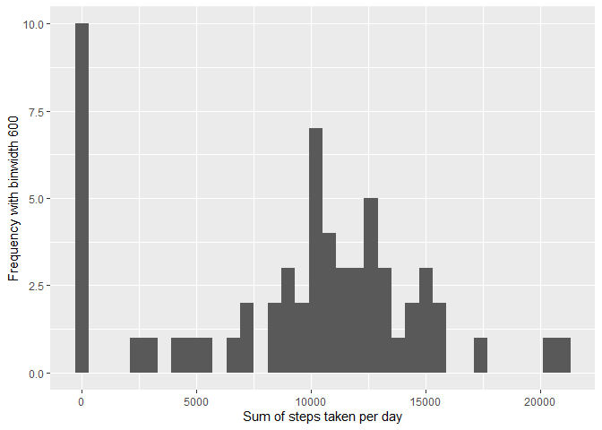
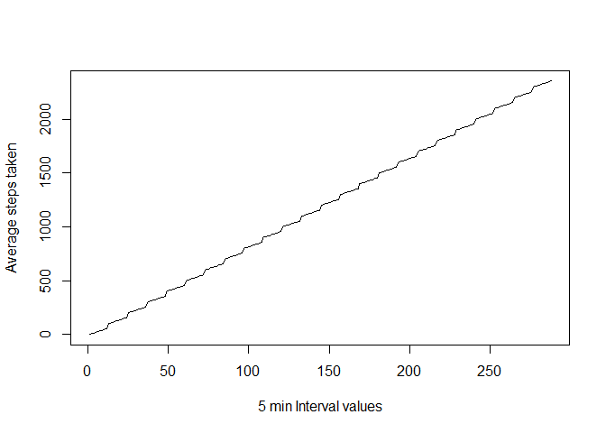
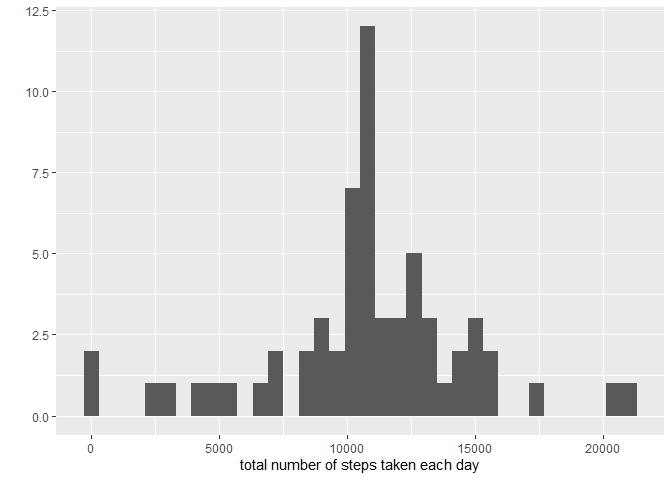

## Loading and preprocessing the data

```r
unzip(zipfile="activity.zip")
data <- read.csv("activity.csv")
```

## What is mean total number of steps taken per day?


```r
library("ggplot2")
sum_steps_perday<-tapply(data$steps,data$date,FUN = sum,na.rm=TRUE)
qplot(sum_steps_perday,xlab = "Sum of steps taken per day",ylab = "Frequency with binwidth 600",binwidth=600)
```

<!-- -->

```r
mean_steps<-mean(sum_steps_perday,na.rm = TRUE)
median_steps<-median(sum_steps_perday,na.rm = TRUE)
```

## What is the average daily activity pattern?

```r
daily_average_by_interval<-aggregate(data$steps,by=list(data$interval),mean,na.rm=TRUE)
colnames(daily_average_by_interval)<-c("Interval","Average Steps")
plot(x=daily_average_by_interval$Interval,y=daily_average_by_interval$Steps,type="l",xlab="5 min Interval values",ylab="Average steps taken")
```

<!-- -->
# Which 5-minute interval, on average across all the days in the dataset, contains the maximum number of steps?

```r
daily_average_by_interval[which.max(daily_average_by_interval$`Average Steps`),]
```

```
##     Interval Average Steps
## 104      835      206.1698
```

## Imputing missing values

```r
library("Hmisc")
```

```
## Loading required package: lattice
```

```
## Loading required package: survival
```

```
## Loading required package: Formula
```

```
## 
## Attaching package: 'Hmisc'
```

```
## The following objects are masked from 'package:base':
## 
##     format.pval, units
```

```r
table(is.na(data))
```

```
## 
## FALSE  TRUE 
## 50400  2304
```

```r
data_imputed<-data
data_imputed$steps<-impute(data_imputed$steps,fun = mean)
data_imputed$interval<-impute(data_imputed$interval,fun = mean)
data_imputed$date<-impute(data_imputed$date,fun = mean)
```
# To check if imputed data set doesn't have NA's


```r
table(is.na(data_imputed))
```

```
## 
## FALSE 
## 52704
```
### Make a histogram of the total number of steps taken each day and Calculate and report the mean and median total number of steps taken per day. Do these values differ from the estimates from the first part of the assignment? What is the impact of imputing missing data on the estimates of the total daily number of steps?

```r
total_steps_imputed<-tapply(data_imputed$steps,data_imputed$date,FUN = sum)
qplot(total_steps_imputed, binwidth = 600, xlab = "total number of steps taken each day")
```

<!-- -->

```r
mean(total_steps_imputed)
```

```
## [1] 10766.19
```

```r
median(total_steps_imputed)
```

```
## [1] 10766.19
```
## Are there differences in activity patterns between weekdays and weekends?

```r
library(dplyr)
```

```
## 
## Attaching package: 'dplyr'
```

```
## The following objects are masked from 'package:Hmisc':
## 
##     src, summarize
```

```
## The following objects are masked from 'package:stats':
## 
##     filter, lag
```

```
## The following objects are masked from 'package:base':
## 
##     intersect, setdiff, setequal, union
```

```r
data_imputed$date_type<-ifelse(weekdays(as.Date(data_imputed$date)) %in% c("Saturday", "Sunday"), "weekend", "weekday")
```
**Alternative code**
library(lubridate)
data_imputed$date_type<-ifelse(wday(as.POSIXct(data_imputed$date)) %in% c(1,7) ,yes='weekend', no='weekday')


```r
averages_activity <- aggregate(steps ~ interval + date_type, data=data_imputed, mean)
averages_activity %>% ggplot(aes(x=interval,y=steps))+ geom_line()+facet_grid(rows=vars(date_type))
```

<!-- -->

